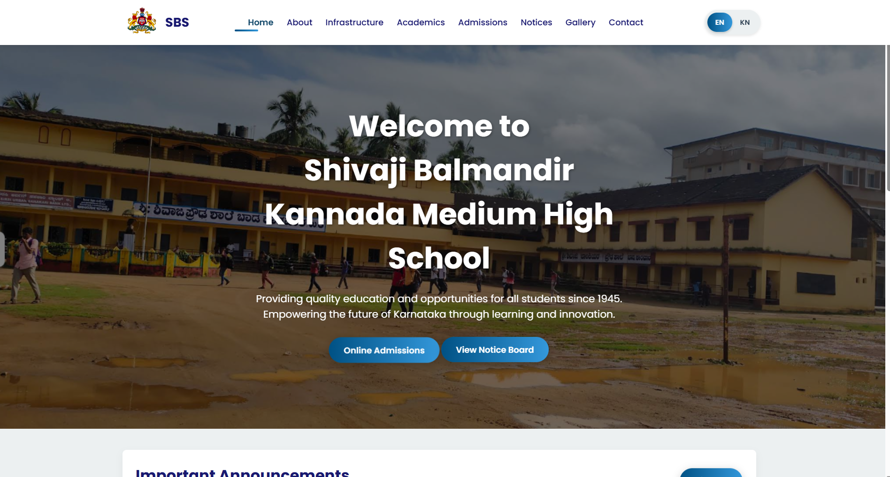
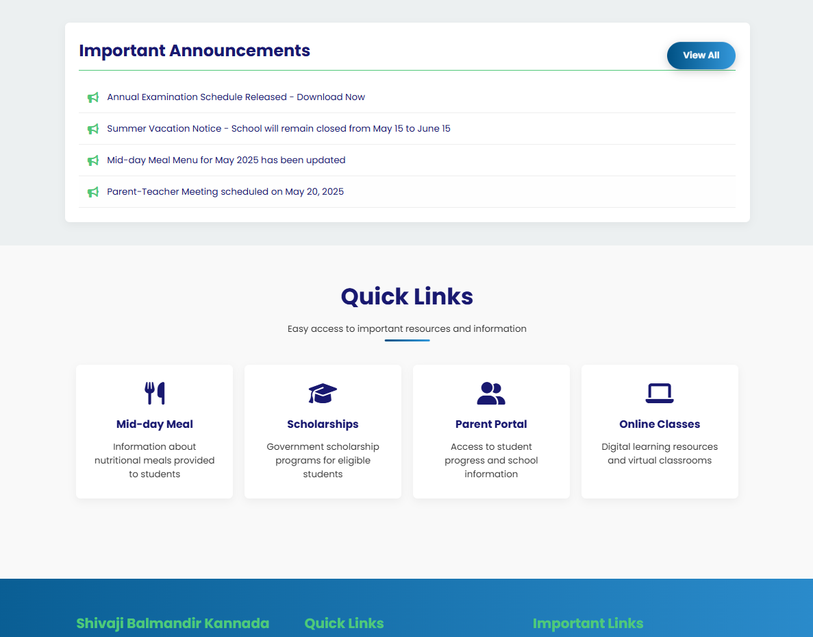
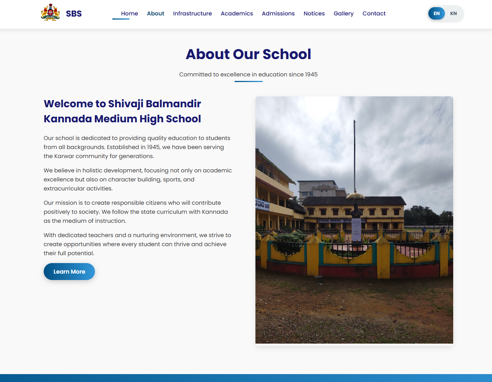
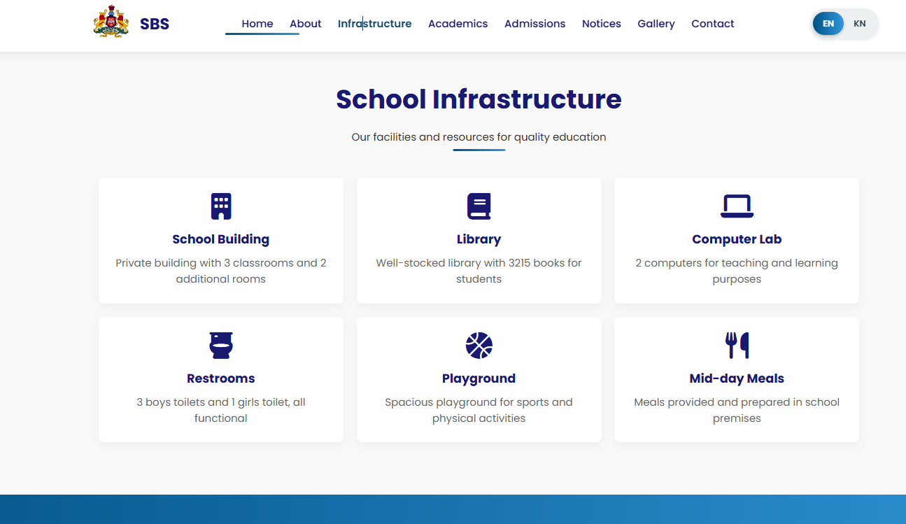
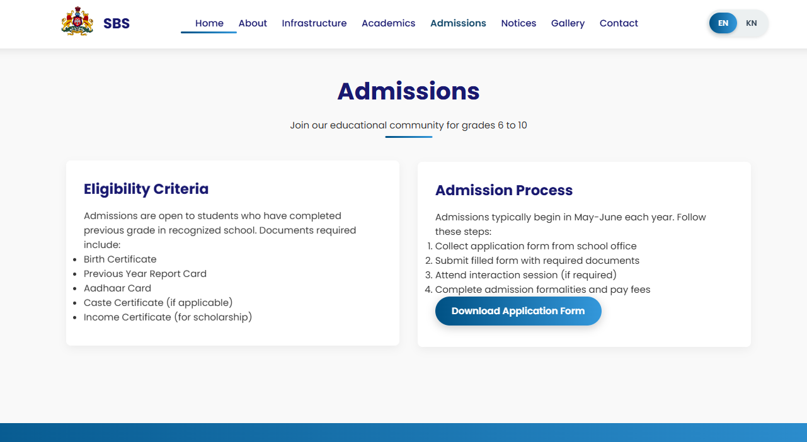
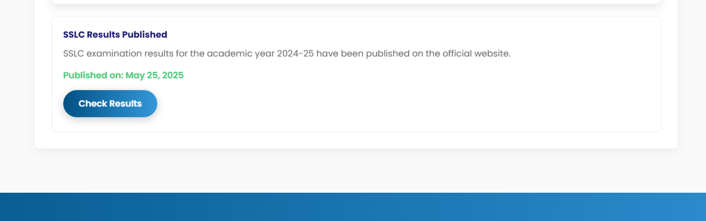
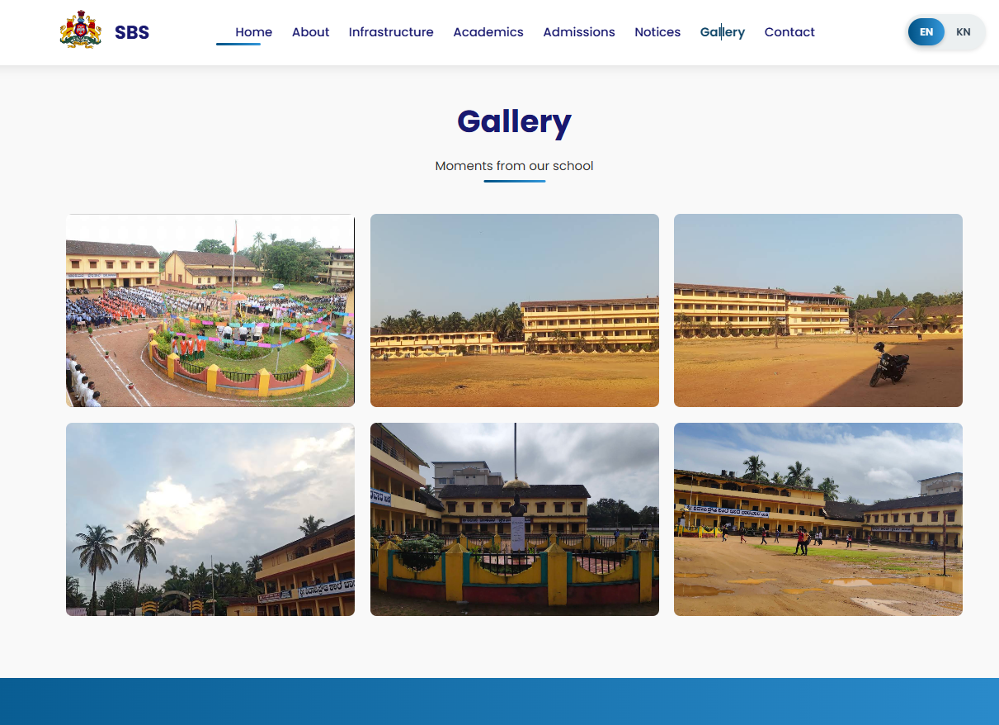
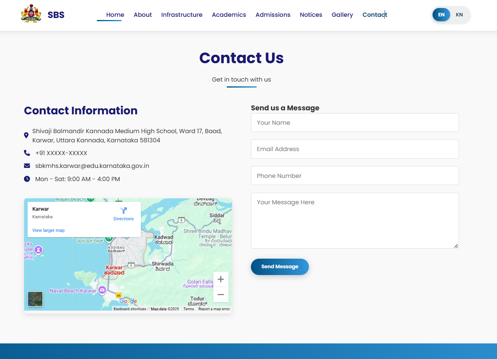
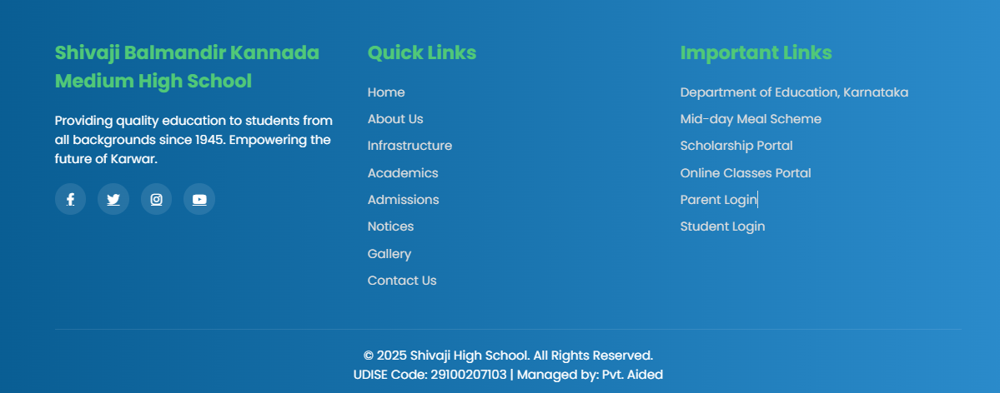
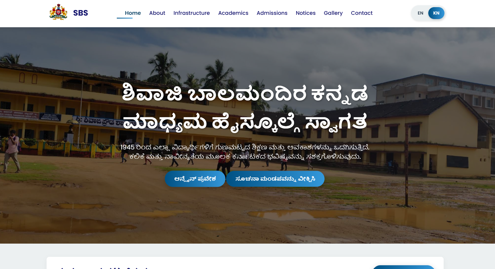

# 🏫 School Web

A responsive school website for **Shivaji Balmandir Kannada Medium School, Baad Karwar**.  
The website includes sections like **Home, About, Infrastructure, Academy, Admission, Notice, Gallery, and Contact**.  
It also features a **language toggle** to switch between **English** and **Kannada**.

## 🔗 Live Link: [School Web](https://adityamahekar.github.io/School_web/)

## ✨ Features
- 🌐 Responsive design for desktop and mobile  
- 🏠 Home, ℹ️ About, 🏢 Infrastructure, 🎓 Academy, 📝 Admission, 📢 Notice, 🖼️ Gallery, and 📞 Contact pages  
- 🔻 Footer with school information  
- 🌏 Language toggle option (English / Kannada)  
- 🖼️ Image gallery showcasing school facilities  
---
## 🛠️ Technologies Used
- HTML5 📝
- CSS3 🎨
- JavaScript ⚡
- Responsive Design 📱
- Optional: Bootstrap for styling 🖌️
- ---
## 🖼️Gallery

| Home Page|  Home Page 2 |
|-----|-----|
|  | |

| About Page | Infrastructure Overview |
|-----|-----|
|  |  |

|Academy Section | Admission Page |
|-----|-----|
|  |  |

| Notice Board | Notice Board 2 |
|-----|-----|
|  |  |

| Gallery Section  | Contact Page |
|------|------|
| |  |

| Footer Section| Language Toggle Feature|
|------|------|
|  |  |

